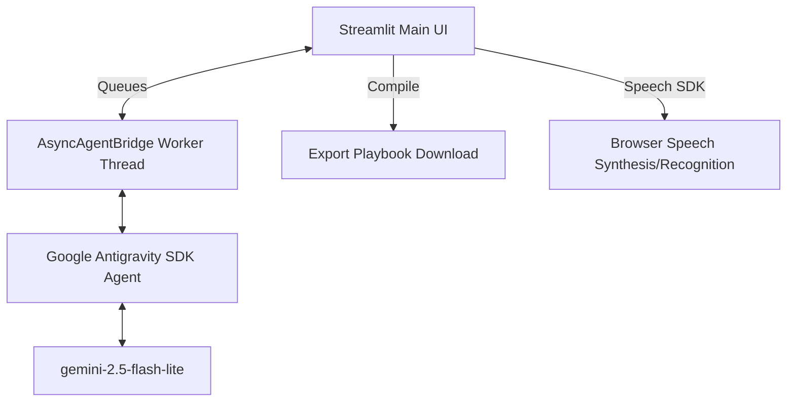

# 🎓 AI Placement Mentor Portal

An advanced multi-agent system designed to guide students through the university placement preparation pipeline. Built using Streamlit and the Google Antigravity SDK, this application coordinates four specialized AI agents to help students build profiles, optimize resumes, practice mock interviews with voice capabilities, and analyze skill gaps.

---

## 🚀 Key Features

### 1. Multi-Agent Systems (google-antigravity SDK)
* **Profile Setup (ProfileAgent)**: Conversational assistant that collects branch, year of study, target job roles, target companies, and student weaknesses one-by-one, exporting details to `student_profile.json`.
* **Resume Review (ResumeAgent)**: Analyzes resumes against target job descriptions and generates structure, wording, and formatting feedback in `resume_feedback.md`.
* **Mock Panel Interview (InterviewPanelAgent)**: Simulates a realistic debate between a **Hiring Manager** (behavioral), a **Peer Engineer** (technical/system design), and an **Executive** (culture & core competency).
* **Skill Gap Analysis (SkillGapAgent)**: Resolves current student skills and compares them to company-specific requirements (e.g., deep DSA for Google, low latency for finance) to output a prioritized "what to learn next" roadmap saved to `skill_gap_report.md`.

### 2. Smart Recommendation Engine (Zero-Quota Orchestrator)
* Analyzes student profiles offline.
* Recommends specific preparation tracks dynamically based on weakness keywords:
  - **Mock Interview**: Recommended for anxiety, freezing, or technical round concerns.
  - **Resume Review**: Recommended for resume shortlist, ATS, or call-getting concerns.
  - **Skill Gap Analysis**: Recommended for skill learning or preparation uncertainty.
* Displays a call-to-action banner enabling one-click redirection to the recommended service.

### 🎙️ 3. Web Speech capabilities (Mock Interview Only)
* **Text-to-Speech (TTS)**: Reads interviewer questions aloud automatically using `window.speechSynthesis`.
* **Speech-to-Text (STT)**: An injected microphone `🎤` button allows candidates to dictate response transcripts directly inside the browser using `webkitSpeechRecognition`, bypassing iframe sandbox permission boundaries.

### ⚠️ 4. Human-in-the-Loop Developer Gating
* Pauses evaluation generation if the panel draft contains overly harsh language.
* Pauses the worker thread and displays a developer warning card inside the UI to let you approve or request rewrites (saving decision logs to `human_review_log.txt`).

### 📥 5. Personalized Playbook Export
* Reads all generated reports offline and compiles them into a single markdown placement guide: `placement_playbook_[student_name].md` available via a sidebar download button.

---

## 🛠️ Architecture & Flow Design



---

## 📦 Setup & Running Instructions

### Prerequisites
- Python 3.10+
- Google Chrome or Microsoft Edge (required for Web Speech STT capabilities)

### Installation & Run
1. Clone this repository:
   ```bash
   git clone https://github.com/Mansi-Upadhyay-12/ai-placement-agent.git
   cd ai-placement-agent
   ```
2. Configure credentials in a `.env` file at root:
   ```env
   GEMINI_API_KEY=your_gemini_api_key_here
   ```
3. Initialize virtual environment and install dependencies:
   ```bash
   python -m venv .venv
   source .venv/bin/activate  # On Windows: .venv\Scripts\activate
   pip install -r requirements.txt
   ```
4. Run the Streamlit web app:
   ```bash
   streamlit run app.py
   ```
